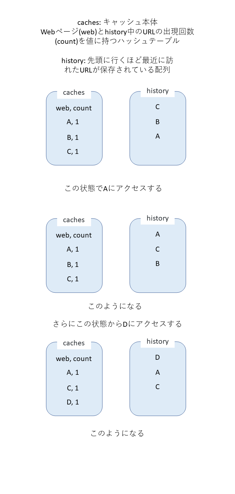

## データ構造

先頭に行くほど最近に訪れたURLが保存されている配列`history`と、URLをキー、Webページ(`web`)と`history`中のURLの出現回数(`count`)を値に持つハッシュテーブル`caches`を用意する

## 手順

1. 新しく訪れたURL`X`が、`caches`中に含まれているか検索する
2. `X`が`caches`中に含まれていた場合、3に進む。そうでない場合、4に進む
3. `caches`中の`X`の`count`を+1し、`history`の先頭に`X`を追加し終了
4. `history`の末尾のURL`Z`の`caches`中の`count`を参照し、2以上なら5に進む。1なら6に進む
5. `Z`の`caches`中の`count`を-1し、`history`の末尾を削除し4に戻る
6. `Z`を`caches`から削除し、`history`の末尾も削除し7に進む
7. `history`の先頭に`X`を追加し、`caches`にも`count`が1の状態で`X`を追加し終了

ハッシュテーブルの検索・追加・削除と、配列の先頭への要素追加、配列の末尾の参照、配列の末尾要素の削除はどれも時間計算量$O(1)$で行えるので、上記のデータ構造と手順で、キャッシュ管理を時間計算量ほぼ$O(1)$で実現できる。

## 改善

上記の手順で、時間計算量はほぼ$O(1)$にすることができたが、同じURLに連続して訪れた場合に、`history`のサイズが大きくなり空間計算量が大きくなってしまうので、上記の手順を少し改善する。

1. 新しく訪れたURL`X`が、`caches`中に含まれているか検索する
2. `X`が`caches`中に含まれていた場合、3に進む。そうでない場合、7に進む
3. `history`の先頭を参照し、`X`と一致したら何もせず終了。そうでない場合、4に進む
4. `caches`中の`X`の`count`を+1し、`history`の先頭に`X`を追加し5に進む
5. `history`の末尾のURL`Z`の`caches`中の`count`を参照し、2以上なら6に進む。1なら終了
6. `Z`の`caches`中の`count`を-1し、`history`の末尾を削除し5に戻る
7. `history`の末尾のURL`Z`の`caches`中の`count`を参照し、2以上なら8に進む。1なら9に進む
8. `Z`の`caches`中の`count`を-1し、`history`の末尾を削除し7に戻る
9. `Z`を`caches`から削除し、`history`の末尾も削除し10に進む
10. `history`の先頭に`X`を追加し、`caches`にも`count`が1の状態で`X`を追加し終了

少し手順は複雑になったが、この手順で、時間計算量はほぼ$O(1)$に維持したまま、同じURLに連続して訪れた場合に`history`のサイズが大きくなってしまう問題を改善できる。

操作例は以下の通り

